# TAS8 - SENTENCIA MULTIPLE WHERE
###### Javier Peña

## 1. Creacion de la tabla clientes
  - Sentencia:
  ```
  CREATE TABLE client (
  id SERIAL PRIMARY KEY,
  nui VARCHAR(50) NOT NULL,
  fullname VARCHAR(50),
  phone VARCHAR(15),
  client_type VARCHAR(10),
  city VARCHAR(50),
  credit_limit INT,
  UNIQUE(nui)
);
  ```
  - Captura:

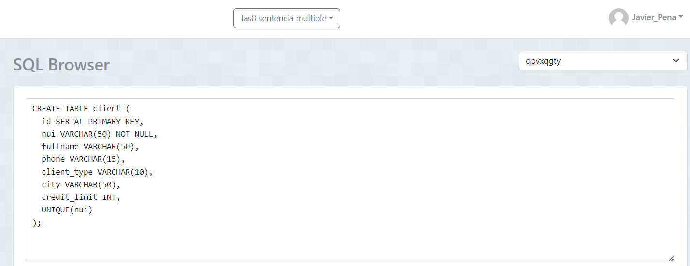

## 2. Creacion de la tabla productos
  - Sentencia:
  ```
  CREATE TABLE product (
  id SERIAL PRIMARY KEY,
  description VARCHAR(50) NOT NULL,
  price DECIMAL(10, 2),
  category VARCHAR(30),
  country_of_origin VARCHAR(30),
  year_of_production INT
);
  ```
  - Captura:

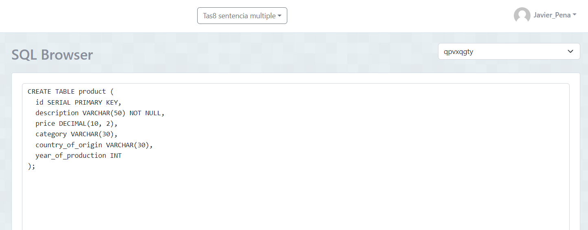

## 3. Inserción de datos en la tabla clientes
  ```
  INSERT INTO client (nui, fullname, phone, client_type, city, credit_limit)
VALUES
('NUI1234567890', 'John Doe', '1234567890', 'Regular', 'New York', 5000),
('NUI0987654321', 'Jane Smith', '0987654321', 'Premium', 'Los Angeles', 10000),
('NUI1122334455', 'Alice Johnson', '1122334455', 'Regular', 'Chicago', 3000),
('NUI2233445566', 'Bob Brown', '2233445566', 'Regular', 'Houston', 4000),
('NUI3344556677', 'Charlie Davis', '3344556677', 'Premium', 'Phoenix', 8000),
('NUI4455667788', 'David Wilson', '4455667788', 'Regular', 'Philadelphia', 3500),
('NUI5566778899', 'Eva Harris', '5566778899', 'Regular', 'San Antonio', 3000),
('NUI6677889900', 'Frank Clark', '6677889900', 'Premium', 'San Diego', 9000),
('NUI7788990011', 'Grace Lewis', '7788990011', 'Regular', 'Dallas', 4500),
('NUI8899001122', 'Hannah Walker', '8899001122', 'Premium', 'San Jose', 7500);
  ```
  - Captura:

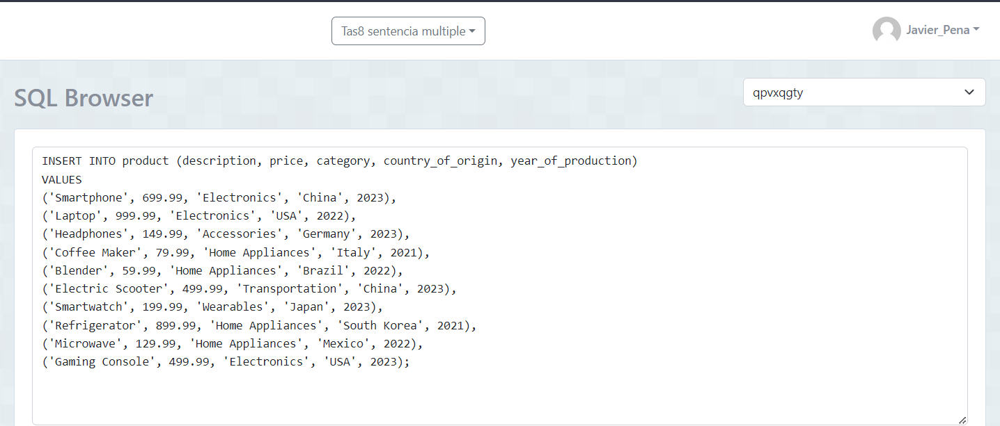

## 4. Inserción de datos en la tabla productos
  ```
  INSERT INTO product (description, price, category, country_of_origin, year_of_production)
VALUES
('Smartphone', 699.99, 'Electronics', 'China', 2023),
('Laptop', 999.99, 'Electronics', 'USA', 2022),
('Headphones', 149.99, 'Accessories', 'Germany', 2023),
('Coffee Maker', 79.99, 'Home Appliances', 'Italy', 2021),
('Blender', 59.99, 'Home Appliances', 'Brazil', 2022),
('Electric Scooter', 499.99, 'Transportation', 'China', 2023),
('Smartwatch', 199.99, 'Wearables', 'Japan', 2023),
('Refrigerator', 899.99, 'Home Appliances', 'South Korea', 2021),
('Microwave', 129.99, 'Home Appliances', 'Mexico', 2022),
('Gaming Console', 499.99, 'Electronics', 'USA', 2023);
  ```
  - Captura:

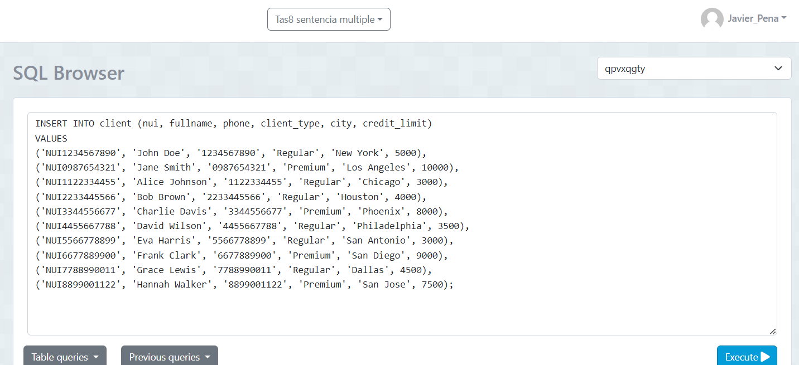

## 5. Contar el número de productos de una categoría específica.
  ```
  SELECT COUNT(*) AS number_of_products
FROM product
WHERE category = 'Electronics';

  ```
  - Captura:

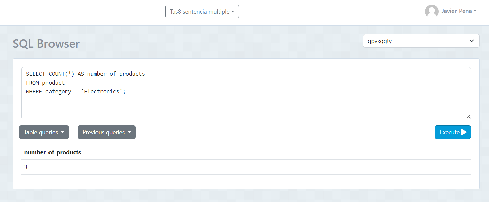

## 6. Contar el número de clientes en una ciudad específica.
  ```
  SELECT COUNT(*) AS number_of_clients
FROM client
WHERE city = 'New York';

  ```
  - Captura:


## 7. Contar el número de productos cuyo precio está dentro de un rango específico 
  ```
  SELECT COUNT(*) AS number_of_products
FROM product
WHERE price BETWEEN 100 AND 500;


  ```
  - Captura:

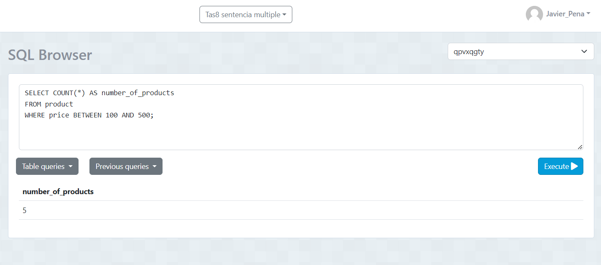

## 8. Seleccionar clientes que viven en una ciudad específica y tienen un tipo de cliente específico
  ```
  SELECT * 
FROM client
WHERE city = 'New York' AND client_type = 'Regular';
;
  ```
  - Captura:

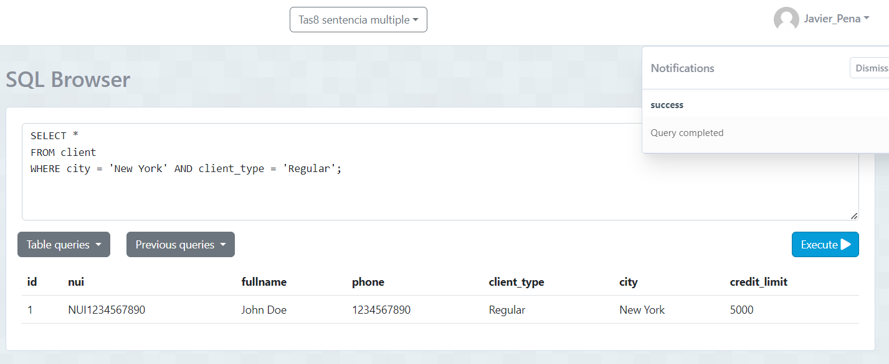

## 9. Seleccionar productos que pertenecen a una categoría específica y cuyo precio está por encima de un valor específico
  ```
  SELECT * 
FROM product
WHERE category = 'Electronics' AND price > 500;

  ```
  - Captura:

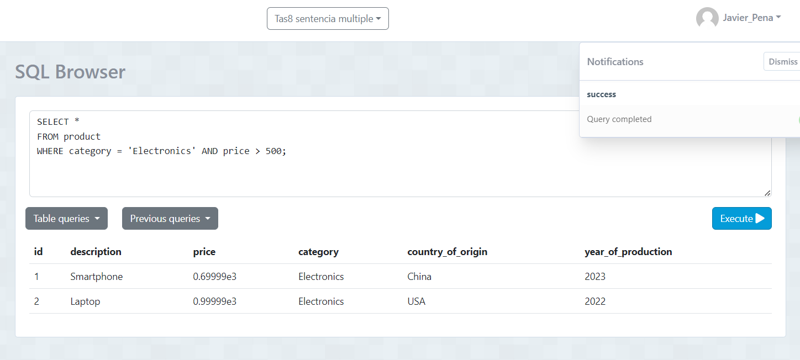

## 10. Seleccionar productos que fueron producidos en un año específico y en un país de origen específico
  ```
  SELECT * 
FROM product
WHERE year_of_production = 2023 AND country_of_origin = 'China';

  ```
  - Captura:

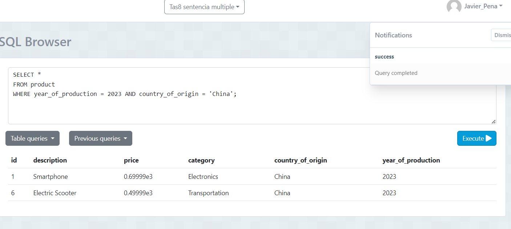

## 11. Seleccionar clientes cuyo nombre completo comience con 'J'.
  ```
  SELECT *
FROM client
WHERE fullname LIKE 'J%';


  ```
  - Captura:

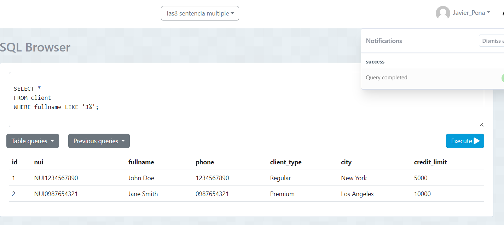

## 12. Seleccionar clientes cuya ciudad contenga la letra 'a'
  ```
  SELECT *
FROM client
WHERE city LIKE '%a%';


  ```
  - Captura:

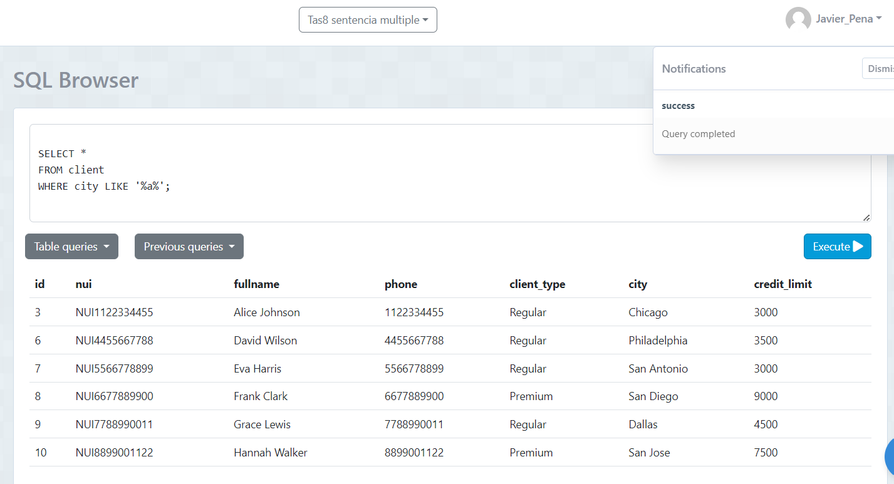